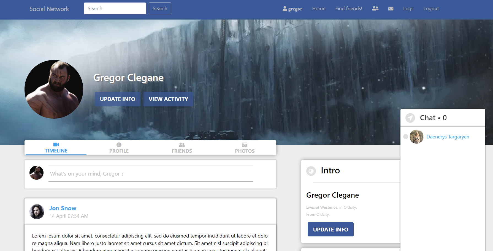
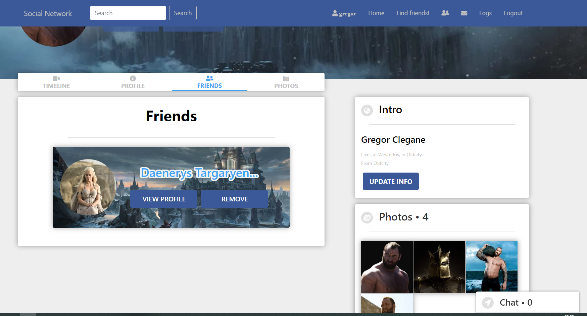
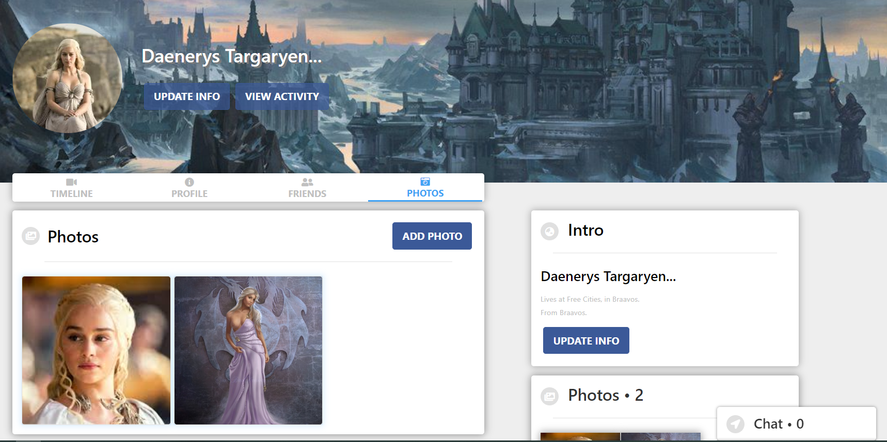

# Social-Network-Dockerized

Social-Network-Dockerized is the dockerized version of my [Social-Network](https://github.com/kostadinlambov/Social-Network/) application. 
This project contains a single docker-compose.yml file with three services:
- app-server - the server of the application (Spring Boot)
- app-client - the client of the application (React.JS)
- db - the databease of the application (MySql)

The images for the [app-server](https://hub.docker.com/repository/docker/klambov/kl-social-network-server) and [app-client](https://hub.docker.com/repository/docker/klambov/kl-social-network-client) are already built and pushed to [Docker Hub](https://hub.docker.com/).


## Requirements

1. Install [Docker](https://www.docker.com/products/docker-desktop)

2. In order to be able to save `Photos` you need to sign up to [Cloudinary](https://cloudinary.com/) and enter your credentials in the `app-server` service of the `docker-compose.yml`

3. Stop your locally running `SQL-Server`, if you have any

## Steps to Setup

1. **Clone the application**

	```bash
	git clone https://github.com/kostadinlambov/Social-Network-Dockerized.git
	cd Social-Network-Dockerized
	```

2. **Start the application**

Run in the project directory:

```bash
docker-compose up -d
```

The front-end server will start on port `9090`. To open it enter in your browser:

```bash
http://localhost:9090
```

3. **Stop the application**

You can stop the containers with:

 ```bash 
 docker-compose down
 ```
## App screenshots

1. **Home Page**

 

2. **Friends Page**

 

3. **Photos Page**

 
